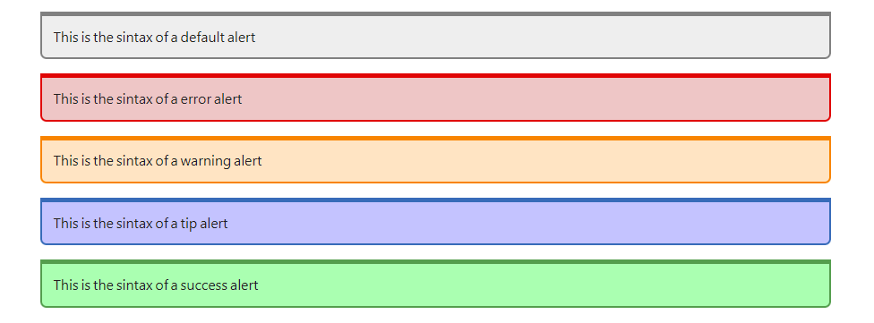

# Pandoc Style

This is repository contains the HTML template, CSS styles (written in *Less*) and compiler (written in *Python*) that you can use to compile a Markdown file into html. Of course, the syntax is markdown and supports pretty much every markdown functionality you can imagine since Pandoc has great compatibility.

## 🦴 Layout of the HTML template

The html template is pretty basic.

1. First, you have the boilerplate code that look somewhat like the following

```html
<!DOCTYPE html>
<html lang="en">
<head>
	<meta charset="UTF-8">
	<meta http-equiv="X-UA-Compatible" content="IE=edge">
	<meta name="viewport" content="width=device-width, initial-scale=1.0">
	<title></title>
</head>
<body>

</body>
</html>
```

2. Then, you have all the things that take care of syntax highlighting. These are the `<script> $highlighting-js$ </script>` and `<style> $highlighting-css$ </style>`. Both of these, once in the compile process, will be replaced with the proper Javascript and CSS code that will do the syntax highlighting.

3. Now you have the final part (and probably the most fun), the styling. The styling of the document is done in two separate HTML `<style>` tag. The fist one bein the [*Normalize.css*](https://necolas.github.io/normalize.css/) (with some changes made by me) and the second one being the actual CSS code that gives style to everything.

### 📓 Things to note

##### 🛑 Alert Styles
I have introduced a bit of a syntax that lets you create alerts of different types. These currently are:

- Alert-default
- Alert-error
- Alert-warning
- Alert-tip
- Alert-success

Here is how you should format the markdown in order to obtain each alert type

```markdown
:::alert-default
This is the sintax of a default alert
:::

:::alert-error
This is the sintax of a error alert
:::

:::alert-warning
This is the sintax of a warning alert
:::

:::alert-tip
This is the sintax of a tip alert
:::

:::alert-success
This is the sintax of a success alert
:::
```

And here is how it looks in the rendered HTML



See [Indes.less](./css/index.less) file for more information

# Live demo

You can find a demo in the following links:

Compiled Markdown code into [HTML](https://stefanolomo.github.io/pandoc-styling/compiledExample/CompiledMarkdown.html)

The Markdown code from the example avobe [here](https://stefanolomo.github.io/pandoc-styling/compiledExample/md.md)